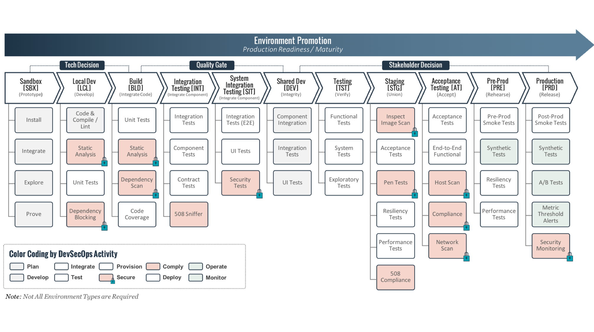

Solutions Delivery Platform
===========================

So you're interested in the Solutions Delivery Platform? Great! You've come to the right place.  These docs will serve as your one-stop-shop for everything SDP.  From reference architectures to installation,
configuration, tool integration, and the nitty gritty of how it works under the hood:  you'll find it here.

What problem are we trying to solve?
####################################

Every time a modern software delivery engagement starts you need two things: a platform upon which applications will be built, and a method to get those applications onto the platform.

In practice, this means that the first 3 to 6 months are spent building the plaform and corresponding pipeline.  Writing a pipeline is largely undifferentiated work. Once you've written
the logic to build a container image with docker and deploy it to an OpenShift cluster, there's no reason to do it again.

Writing a pipeline with Jenkins pipeline-as-code is also an admittedly niche skill.  While not particularly complex, there are enough gotchas that there can be a significant learning curve.
Along the way, best practices were learned that would have saved you so much time!

After the building, versioning, and deploying of artifacts is finished there's still so much to do. Automated testing, both security and functional, still have to be incorporated (often each tool requiring unique integrations).

What if we could use the same software design principles we've been using for our applications all along to build a reusable pipeline?

We can.

Okay, so what *is* it?
######################

.. image:: images/sdp/sdp_chart.png
   :scale: 75%

SDP is a DevSecOps pipeline with organizational governance built in, leveraging a modular design to enable a **single** pipeline for your entire agency.

It can be broken into 3 components:

Container Orchestration Platform
********************************

Modern software delivery often means building cloud-native containerized microservices.  Running 1 container is easy. Running thousands is hard.  Your container
orchestration platform is responsible for running your workloads across a cluster while optionally providing functionality for you like service discovery &
aggregated logging.

We have primarily focused on Kubernetes as our container orchestration platform of choice, more specifically OpenShift.

While the design of SDP decouples everything in such a way that it can be run on any platform, to date we have not automated deployments of SDP to anything
besides OpenShift.

Pipeline Framework
******************

Our pipeline framework is at the center of SDP.  Every tech stack incorporates at least a subset of common software development life cycle phases: build,
package, deploy, unit test, functional test, static code quality analysis.  We leverage these patterns to build a modular pipeline that gets composed at
runtime.

This is best illustrated by example:  when wanting to scan a container image, the method ``scan_container_image`` is called.  Now, if we had a ``Twistlock``
library and a ``OpenSCAP`` library that both contribute their own implementations of ``scan_container_image``, then depending on which library we load, we'll
get different functionality.

DevSecOps Dashboard
*******************

Your DevSecOps pipeline is generating a ton of data around your software delivery practices.  It knows how often you deploy to each application environment,
your branching strategies, and the results of all the functional and security automated testing that goes on.  The aim of the DevSecOps dashboard is to
aggregate this data into actionable insights empowering you to streamline your software delivery processes by identifying areas of improvement more easily.

Now what?
---------

Are you pumped? I'm pumped.  Head over to the :ref:`Getting Started<Getting Started>` page to start deploying a DevSecOps pipeline for your project.

.. toctree::
   :hidden:
   :maxdepth: 1
   :titlesonly:

   pages/getting-started/index
   pages/libraries/index
   pages/for-framework-devs/index
   pages/for-library-devs/index
   pages/for-sdp-users/index
   pages/how-to/index
   pages/contribute-to-docs

