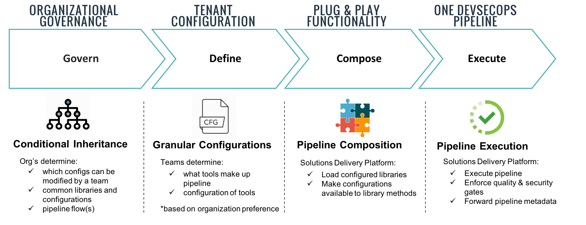

.. _For SDP Users: 
For SDP Users
=============

Here you'll find information on using and configuring the Solutions Delivery Platform. 

The execution of SDP can be broken into four phases: 

There are 3 configuration files in the Solutions Delivery Platform. 

1. `The SDP default configuration file`_
2. The organizational configuration file
3. The tenant configuration file 

Each of these config files gets aggregated together based the rules laid out in :ref:`conditional inheritance` .

In this section of the docs, we'll lay out every customization in the SDP framework configurable by organizations
and tenants. 

.. toctree::
   :maxdepth: 1
   :glob:
   :caption: Contents:

   *

.. _The SDP default configuration file: https://github.boozallencsn.com/solutions-delivery-platform/pipeline-framework/blob/master/resources/sdp/pipeline_config.groovy
