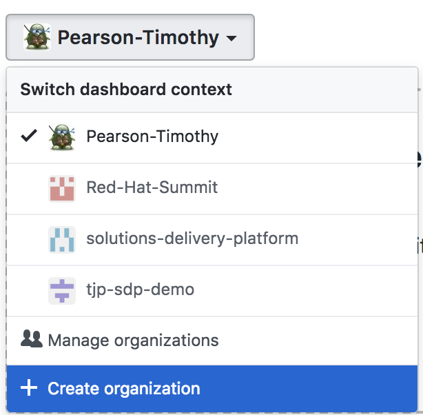

----------------------------
Create a GitHub Organization
----------------------------

This step is optional if you already have a GitHub organization, or if you choose to place all your repositories under a user account. The SDP allows you to use a single pipeline definition for an entire business organization. Typically, each business organization maps to one GitHub organization.

If you're starting from a blank slate and don't have a GitHub organization already, go ahead and `create one`_ on GitHub's site.

.. _create one: https://help.github.com/articles/creating-a-new-organization-from-scratch/

 

